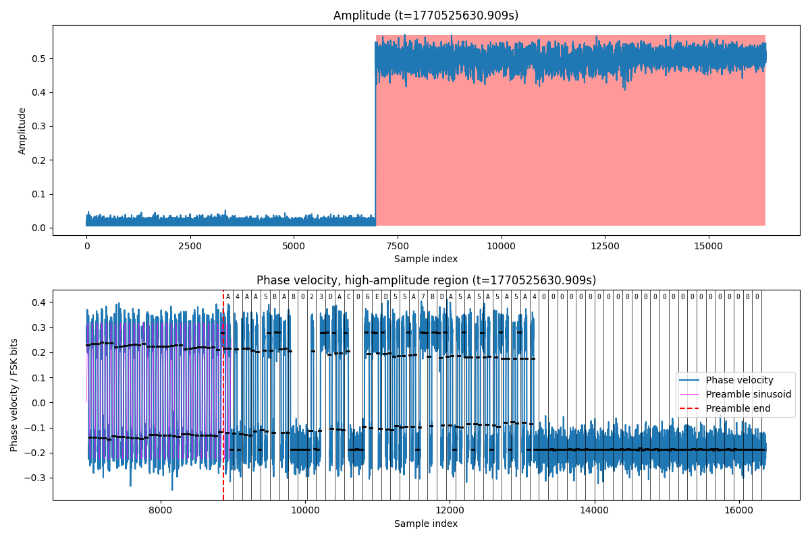

# Decode FSK packets from an SDR

This package is me learning how to use a Software Defined Radio (SDR) to decode
FSK packets from various devices in my neighborhood. I wasn't sure what I should look for, so I started
building the decoding stack step by step. It visually decodes FSK packets like this:

The [notebook](pyrtlfm/pipeline.ipynb) walks through the steps and algorithms used.
